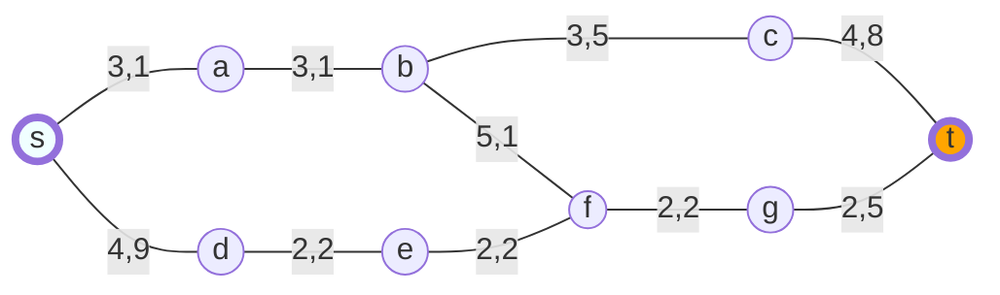
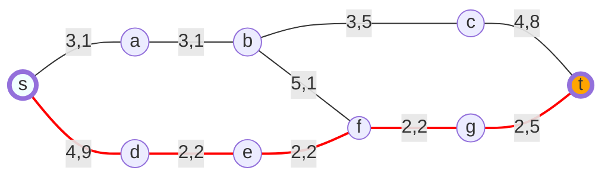
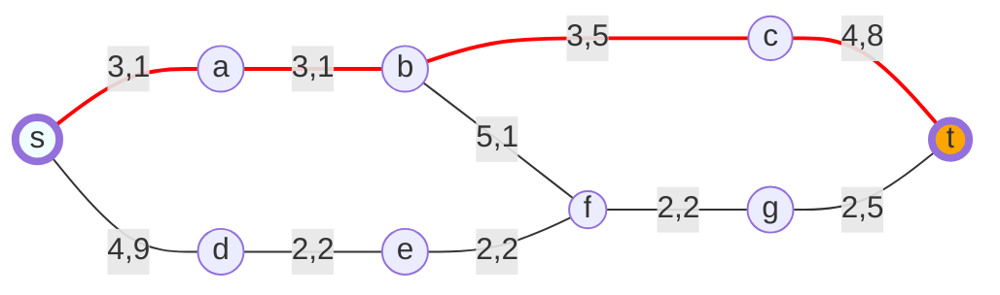
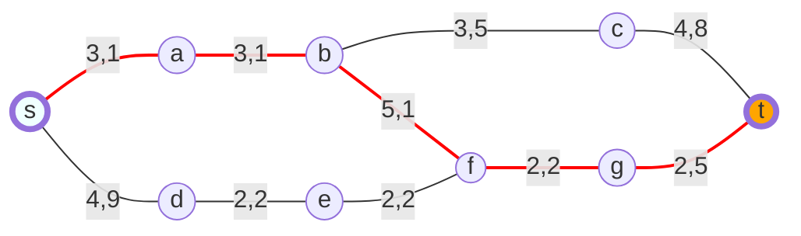
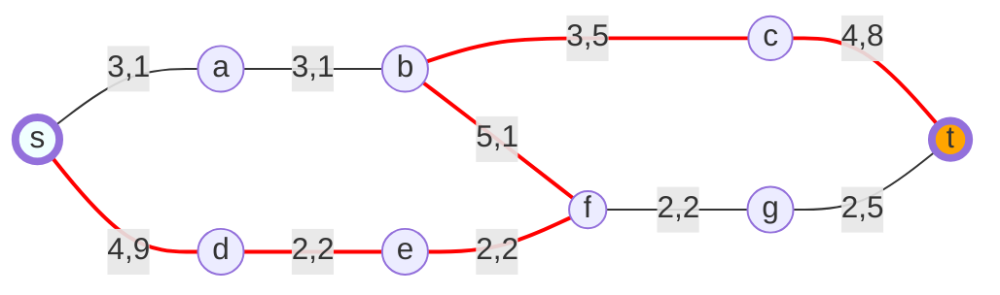

<style>
mark{
    color:red;
}

.center {
  display: block;
  margin-left: auto;
  margin-right: auto;
}

.purple{
  color:#7030A0;
}

.destaque{
  color:#7030A0;
}

p{
  margin: 4rem 0;
}

.break{
  display: block;
  margin:80px 0px
}

.nodeLabel span {
    color: darkorange !important;
}
</style>

# Motivação

__Por que estudar grafos?__
  * Importante ferramenta matemática com aplicação em diversas áreas do conhecimento
  * Utilizados na definição e/ou resolução de problemas
  * Existem centenas de problemas computacionais que empregam grafos com sucesso\.

# As pontes de Königsberg

Em Königsber, Alemanha, um rio que passava pela cidade tinha uma ilha e, logo depois de passar por essa ilha se bifurcava em 2 ramos. Nessa região existiam 7 pontes, como mostra a figura.


<span class="destaque">É possível andar por toda a cidade de tal modo que cada ponte seja atravessada exatamente uma vez?</span>

__Não é possível__


__Remodelando o problema__


O problema agora consiste em percorrer todos os arcos, passando por cada um apenas uma vez, sem levantar o lápis do papel.


# Teoria de Grafos

Na teoria de grafos, um caminho completo com as propriedades descritas acima de não retraçar nenhum arco é chamado de TRAJETÓRIA de EULER.

## Grafos e Subgrafos


## Definição


Se <span class="destaque">e=\(u,v\)</span> então dizemos que __e__  une __u__  e  __v__ 

\(u e v \) são ditos __extremos__ de e

### Exemplo1:

G=\(V\(G\), E\(G\), &Psi; G\), onde
  * V\(G\) =\{v1, v2, v3, v4, v5 \}
  * E\(G\)=\{e1,e2, e3, e4, e5, e6, e7 , e8\}
  * &Psi; G :
    * G\(e1\)= \(v1, v2\), G\(e2\)= \(v2, v3\),
    * G\(e3\)= \(v3, v3\), G\(e4\)= \(v3, v4\),
    * G\(e5\)= \(v2, v4\), G\(e6\)= \(v4, v5\),
    * G\(e7\)= \(v2, v5\), G\(e8\)= \(v2, v5\)

### Exemplo2:

* H=\(V\(H\), E\(H\), &tau;H\), onde
  * V\(H\) =\{u, v, w, x, y\}
  * E\(H\)=\{a, b, c, d, e, f, g, h\}
  * &tau;H :
    * G\(a\)= \(u, v\), G\(b\)= \(u, u\),
    * G\(c\)= \(v, w\), G\(d\)= \(w, x\),
    * G\(e\)= \(v, x\), G\(f\)= \(w, x\),
    * G\(g\)= \(u, x\), G\(h\)= \(x, y\)

### Observações

- Grafos são assim chamados por poderem ser representados graficamente.

- <span class="destaque">Existe uma única maneira de desenhar um grafo?</span>

- Duas arestas num diagrama de um grafo podem se interceptar num ponto que não é um vértice.

- Grafos que possuem uma representação em que as aresta se interceptem apenas em seus extremos são chamados <span class="destaque">planares</span>.


## Definições e Conceitos

Os extremos de uma aresta são ditos <span class="destaque">incidentes</span> com a aresta, e vice\-versa\.

__Ex\.:__


__u__ e __v__ são incidentes a __e__, __e__ é incidente a __u__ e a __v__


Dois vértices que são incidentes a uma mesma aresta são ditos <span class="destaque">adjacentes</span>.


__Ex\.:__


__u__ e __v__ são <span class="destaque">adjacentes</span>


Duas arestas com um extremo em comum são ditas <span class="destaque">adjacentes</span>.

__Ex\.:__


__u__ e __v__ são __adjacentes__, __e__ e __e'__ são adjacentes


<span class="destaque">Loop</span>: uma aresta com extremos idênticos


<span class="destaque">Link</span>: aresta com extremos diferentes


<span class="destaque">Aresta Múltipla</span>: links com mesmos extremos


Um grafo é <span class="destaque">finito</span> se __V\(G\)__ e __E\(G\)__ são finitos

* __Estudaremos apenas grafos finitos\.__
  
Grafos com apenas um vértice são ditos <span class="destaque">triviais</span>\.

Um grafo é <span class="destaque">simples</span> se não possuir loops e arestas múltiplas\.

## Notação

__G__: Grafo com conjunto de vértices __V\(G\)__ e conjunto de arestas __E\(G\)__.

n : número de vértices de __G__

m : número de arestas de __G__

### Isomorfismo entre Grafos

* Dois grafos G e H são <span class="destaque">idênticos</span> se
  * V\(G\)=V\(H\);
  * E\(G\)=E\(H\);
  * &psi;G = &tau;H

__Exemplo: G === H ?__


### Classes especiais de grafos

<span class="destaque">Grafo Completo</span>: grafo simples em que cada par de vértices distintos possui um aresta\.

<span class="destaque">Grafo Vazio</span>: é um grafo sem arestas\.

## Matriz de Incidência (v x e)

MG=\[mij\]
  * __mij__ é o número de vezes que __vi__ e __ej__ são incidentes.


## Matriz de Adjacência (v x v)

AG=\[aij\]
  * __aij__ é o número de arestas ligando __vi__ e __vj__


## Grau dos vértices

O grau __dG\(v\)__ de um vértice __v__ em __G__ é o número de arestas de __G__ incidentes a __v__
  * Cada loop conta como duas arestas
  * &delta;\(G\): grau mínimo de G
  * &Delta;\(G\): grau máximo de G

# Técnicas de Buscas Heurísticas

Baseiam os seus algoritmos em algum conhecimento que pode ajudar a acelerar a solução do problema\.

__Exemplo__: estimativa da distância entre os nós e a meta\.

Geralmente <span class="destaque">não garantem a solução ótima</span>, pois os parâmetros são incertos\.

Na maioria das vezes conseguem <span class="destaque">acelerar o processo</span>, pois exploram direções aparentemente boas\.
__Mas isso não é garantido\!__

É comum utilizarmos heurísticas em nosso dia a dia:
  * Se estiver perdido e procurando um rio, provavelmente você irá procurar nas partes mais baixas do terreno\.
  * Se perder as suas chaves, primeiramente você irá procurar em locais como em cima de mesas e no chão\. As chaves até poderiam estar dentro de uma geladeira, mas esse local seria menos provável\.

Se um problema possui um número de estados possíveis muito grande, o que inviabilizaria a busca exaustiva, a solução para esse problema, quando alcançada, passará pelo uso de alguma heurística\.


## Problema

Problema: sair do vértice __s__ e chegar no vértice __t__:

Chamaremos o vértice __s__  de <span class="destaque">origem</span> e o vértice __t__  de <span class="destaque">meta</span>\.


<br>


<br>


Menor caminho: <span class="destaque">14,0</span>

<br>


<br>


Segundo menor caminho: 14,5

<br>


<br>


Terceiro menor caminho: 16,0

<br>


<br>


Maior caminho: 22,7

<br>


<br>


O peso deste problema poderia representar a distância em Km de pois pontos de um trajeto.

> Exercício

Desenhe o grafo que modelaria o problema a seguir:


Agora se fossemos utilizar uma heuristica (distância <span class="destaque">distâncias euclidianas</span> em relação à meta \(distância em linha reta\)\.) para representar nosso problema:


## Busca Melhor Escolha

Essa busca utiliza uma heurística para ordenar a adição dos nós na fila utilizada para determinar a ordem em que os vértices serão percorridos\.

O algoritmo de busca em largura, modificado somente quanto à determinação da ordem de adição dos vértices, é utilizado\.

Para esse problema, a heurística utilizada será:
  * Os nós serão adicionados em ordem de suas <span class="destaque">distâncias euclidianas</span>.
  * Essa distância foi adicionada entre ao lado de cada vértice\.
  <br>
  
  ``` mermaid
  
  
  graph
    S((s)):::wide-- 3,1 ---A((a - <span>8,1</span>))
    S-- 4,9 ---D((d - <span>8,3</span>))
    A-- 3,1 ---B((b - <span>5,2</span>))
    D-- 2,2 ---E((e - <span>6,4</span>))
    B-- 5,1 ---F
    E-- 2,2 ---F((f - <span>4,7</span>))
    B-- 3,5 ---C((c - <span>4,8</span>))
    F-- 2,2 ---G((g - <span>2,5</span>))
    C-- 4,8 ---T((t)):::wide
    G-- 2,5 ---T

style T fill:#FFA500,stroke-width:4px
style S fill:#F0FFFF,stroke-width:4px
classDef wide padding:20px

  
  ```

  <br>

A nossa fila agora é uma fila de instâncias da classe <span class="destaque">Rastreador</span>. Essa classe possui <span class="destaque">um vértice</span> e <span class="destaque">uma referência</span> ao objeto <span class="destaque">Rastreador anterior</span>.
  
Ao instanciar um Rastreador, precisamos passar qual o vértice e, se existir, qual o rastreamento anterior. Isso torna possível sabermos o caminho percorrido até o presente vértice.

A função <span class="destaque">GetOrdenados(no)</span> retorna os vértices que serão percorridos à partir do rastreamento recebido por parâmetro. Os vértices são retornados em uma ordem que deve estar em acordo com a heurística definida. Não se deve retornar um vértice se ele estiver no caminho já percorrido para evitar ciclos.

  <br>
  

  <br>
  
  ``` csharp
  
  bool Buscar(Vertice origem, Vertice meta, IHeuristica e)
{
   var fila = new Fila{Rastreador}();
   Vertice[] ordenados; Rastreador atual;
   fila.Adicionar(new Rastreador(origem, null));
   while (fila.Primeiro != null)
   {
      atual = fila.Primeiro;
      if (atual.Vertice == meta)
         return true;
      else
      {
         ordenados = e.GetOrdenados(atual);
         foreach (Vertice filho in nosOrdenados)
            fila.Adicionar(new Rastreador(filho, atual));
         fila.Remover();
      }
   }
   return false;
}
  
  ```
  <br>
  


  
  Teremos as seguintes estruturas de controle:

  - Fila
  - atual
  - ordenados


