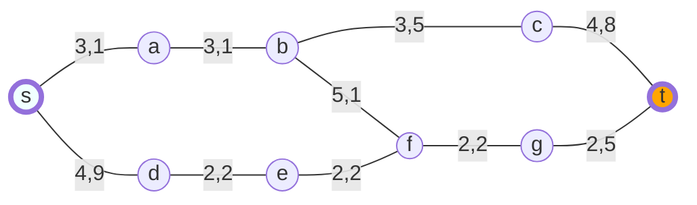
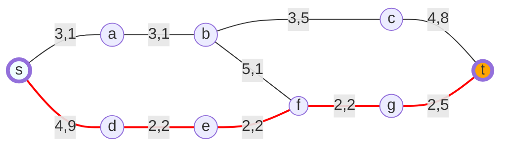
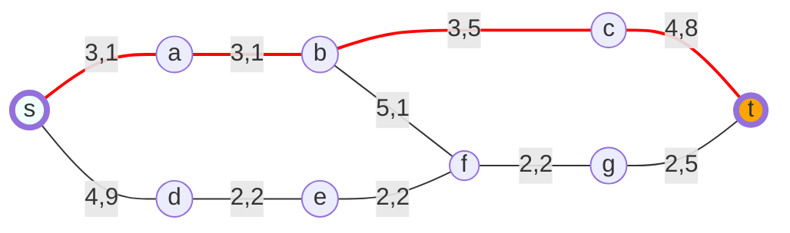
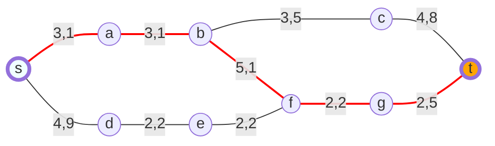
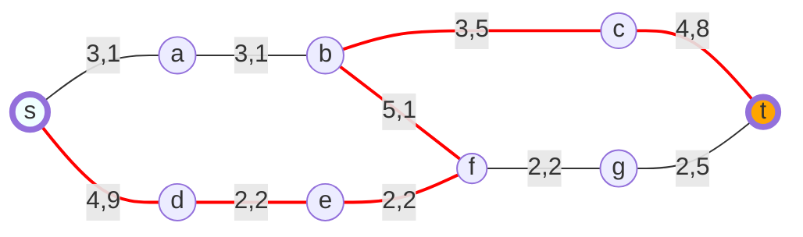

<style>
mark{
    color:red;
}

.center {
  display: block;
  margin-left: auto;
  margin-right: auto;
}

.purple{
  color:#7030A0;
}

.destaque{
  color:#7030A0;
}

p{
  margin: 4rem 0;
}

.break{
  display: block;
  margin:80px 0px
}

.nodeLabel span {
    color: darkorange !important;
}
</style>

# Técnicas de Buscas Heurísticas

Baseiam os seus algoritmos em algum conhecimento que pode ajudar a acelerar a solução do problema\.

__Exemplo__: estimativa da distância entre os nós e a meta\.

Geralmente <span class="destaque">não garantem a solução ótima</span>, pois os parâmetros são incertos\.

Na maioria das vezes conseguem <span class="destaque">acelerar o processo</span>, pois exploram direções aparentemente boas\.
__Mas isso não é garantido\!__

É comum utilizarmos heurísticas em nosso dia a dia:
  * Se estiver perdido e procurando um rio, provavelmente você irá procurar nas partes mais baixas do terreno\.
  * Se perder as suas chaves, primeiramente você irá procurar em locais como em cima de mesas e no chão\. As chaves até poderiam estar dentro de uma geladeira, mas esse local seria menos provável\.

Se um problema possui um número de estados possíveis muito grande, o que inviabilizaria a busca exaustiva, a solução para esse problema, quando alcançada, passará pelo uso de alguma heurística\.


## Problema

Problema: sair do vértice __s__ e chegar no vértice __t__:

Chamaremos o vértice __s__  de <span class="destaque">origem</span> e o vértice __t__  de <span class="destaque">meta</span>\.


<br>


<br>


Menor caminho: <span class="destaque">14,0</span>

<br>


<br>


Segundo menor caminho: 14,5

<br>


<br>


Terceiro menor caminho: 16,0

<br>


<br>


Maior caminho: 22,7

<br>


<br>


O peso deste problema poderia representar a distância em Km de pois pontos de um trajeto.

> Exercício

Desenhe o grafo que modelaria o problema a seguir:


Agora se fossemos utilizar uma heuristica (distância <span class="destaque">distâncias euclidianas</span> em relação à meta \(distância em linha reta\)\.) para representar nosso problema:


# Busca Melhor Escolha

Essa busca utiliza uma heurística para ordenar a adição dos nós na fila utilizada para determinar a ordem em que os vértices serão percorridos\.

O algoritmo de busca em largura, modificado somente quanto à determinação da ordem de adição dos vértices, é utilizado\.

Para esse problema, a heurística utilizada será:
  * Os nós serão adicionados em ordem de suas <span class="destaque">distâncias euclidianas</span>.
  * Essa distância foi adicionada entre ao lado de cada vértice\.
  <br>
  
  ``` mermaid
  
  
  graph
    S((s)):::wide-- 3,1 ---A((a - <span>8,1</span>))
    S-- 4,9 ---D((d - <span>8,3</span>))
    A-- 3,1 ---B((b - <span>5,2</span>))
    D-- 2,2 ---E((e - <span>6,4</span>))
    B-- 5,1 ---F
    E-- 2,2 ---F((f - <span>4,7</span>))
    B-- 3,5 ---C((c - <span>4,8</span>))
    F-- 2,2 ---G((g - <span>2,5</span>))
    C-- 4,8 ---T((t)):::wide
    G-- 2,5 ---T

style T fill:#FFA500,stroke-width:4px
style S fill:#F0FFFF,stroke-width:4px
classDef wide padding:20px

  
  ```

  <br>

A nossa fila agora é uma fila de instâncias da classe <span class="destaque">Rastreador</span>. Essa classe possui <span class="destaque">um vértice</span> e <span class="destaque">uma referência</span> ao objeto <span class="destaque">Rastreador anterior</span>.
  
Ao instanciar um Rastreador, precisamos passar qual o vértice e, se existir, qual o rastreamento anterior. Isso torna possível sabermos o caminho percorrido até o presente vértice.

A função <span class="destaque">GetOrdenados(no)</span> retorna os vértices que serão percorridos à partir do rastreamento recebido por parâmetro. Os vértices são retornados em uma ordem que deve estar em acordo com a heurística definida. Não se deve retornar um vértice se ele estiver no caminho já percorrido para evitar ciclos.

  <br>
  

  <br>
  
  ``` csharp
  
  bool Buscar(Vertice origem, Vertice meta, IHeuristica e)
{
   var fila = new Fila{Rastreador}();
   Vertice[] ordenados; Rastreador atual;
   fila.Adicionar(new Rastreador(origem, null));
   while (fila.Primeiro != null)
   {
      atual = fila.Primeiro;
      if (atual.Vertice == meta)
         return true;
      else
      {
         ordenados = e.GetOrdenados(atual);
         foreach (Vertice filho in nosOrdenados)
            fila.Adicionar(new Rastreador(filho, atual));
         fila.Remover();
      }
   }
   return false;
}
  
  ```
  <br>
  


  
  Teremos as seguintes estruturas de controle:

  - Fila
  - atual
  - ordenados


# Algoritmo Guloso

Procura resolver o problema fazendo a escolha localmente ótima em cada fase.

Apesar de poder eventualmente encontrar um ótimo global, é bastante comum essa busca ser influenciada por ótimos locais.

Para usarmos a técnica Algoritmo Guloso para resolvermos o nosso problema, basta utilizarmos uma <span class="destaque">pilha</span> no lugar da fila utilizada no algoritmo Melhor Escolha.


<br>

``` csharp

bool Buscar(Vertice origem, Vertice meta, IHeuristica e)
{
   var pilha = new Pilha{Rastreador}();
   Vertice[] ordenados; Rastreador atual;
   pilha.Adicionar(new Rastreador(origem, null));
   while (pilha.Primeiro != null)
   {
      atual = pilha.Primeiro;
      if (atual.Vertice == meta)
         return true;
      else
      {
         ordenados = e.GetOrdenados(atual);
         pilha.Remover();
         foreach (Vertice filho in nosOrdenados)
            pilha.Adicionar(new Rastreador(filho, atual));
      }
   }
   return false;
}


```
<br>


# Busca informada (ou heurística)

Utiliza conhecimento sobre o domínio para encontrar soluções mais eficientes do que no caso de busca cega.

Conforme aprendemos a busca pela melhor escolha: expande o nó que possui função de avaliação mais baixa;


## Heureca!

Função de avaliação <span class="destaque">(f(n))</span>: mede o custo de um nó até o objetivo.

Função heurística <span class="destaque">(h(n))</span>: custo estimado do caminho mais econômico do nó n até o nó objetivo.

Heurística = capacidade de resolver problemas


## Busca gulosa (pela melhor escolha)

Expande o nó mais próximo da meta, supondo que isso levará rapidamente a uma solução;

Portanto, <span class="destaque">f(n) = h(n)</span>

Exemplo: encontrar uma rota na Romênia usando da heurística da distância em linha reta (hDLR)


### Busca gulosa: exemplo


### Busca gulosa

Não é ótima, pois segue o melhor passo considerando somente o momento atual.

  * pode haver um caminho melhor seguindo algumas opções piores em alguns pontos da árvore de busca.

<span class="destaque">Minimizar h(n)</span> é suscetível a <span class="destaque">falsos inícios</span>.

Guloso: em cada passo, tenta chegar mais perto do objetivo.

Não é completa: pode seguir caminhos infinitos e nunca volta.


# Busca A*

Avalia nós combinando o custo para alcançar cada nó (<span class="destaque">g(n)</span>) e o custo estimado para ir deste nó até o objetivo (<span class="destaque">h(n)</span>):

<span class="destaque">f(n) = g(n) + h(n)</span>

Para a solução de custo mais baixo,

seguir os estados de menor valor de g(n) + h(n).

## Busca A*: exemplo


Perceberam que A* tomou um rumo diverso do algoritmo guloso??

A* tomou o caminho ótimo..

## Busca Menor Custo ou A*

Se um vértice visitado já existir na lista de vértices abertos:

  * Verifique se o caminho percorrido até chegar a este vértice é menor que o caminho percorrido anteriormente.
  
  * Caso positivo, substitua o caminho do vértice constante na lista para o caminho mais curto.

### Problema

Problema: sair do vértice s e chegar no vértice t.

Chamaremos o vértice s de origem e o vértice t de meta.


Menor caminho: 14,0


Segundo menor caminho: 14,5


Terceiro menor caminho: 16,0


Maior caminho: 22,7


## A*

Para esse problema, a heurística <span class="destaque">ℎ(𝑛) </span>utilizada será:

- Distância euclidiana em relação à meta (distância em linha reta).

- Essa distância foi adicionada entre colchetes ao lado de cada vértice.
  


<br>

### Estruturas necessárias: 

<span class="destaque">custos</span> - Objeto responsável pelo cálculo de 𝑓(𝑛)

<span class="destaque">abertos</span> - Fila que mantém os seus nós ordenados em acordo com o valor de 𝑓(𝑛)

<span class="destaque">fechados</span> - Array associativo que facilita a identificação de vértices já visitados.

<span class="destaque">Rastreador</span>(vertice, Rastreador Anterior, custo) - Agora ao instanciar um rastreamento, é necessário passar o vértice, o Rastreamento anterior e o custo (valor de 𝑓(𝑛)). 

<span class="destaque">Contem</span>(v) - ContainsKey recebe uma chave e retorna verdadeiro se a chave existir no Array associativo 


``` csharp

bool Buscar(ICusto custos, Vertice origem, Vertice meta) {  
   var abertos = new FilaOrdenadaPorCusto(); var atual;
   var fechados = new Dictionary<object, Rastreador>();
   abertos.Adicionar(new Rastreador(origem, null, 0));
   for (atual = abertos.Primeiro; atual != null; atual = abertos.Primeiro)
      if (atual.Vertice == meta)
         return true;
      else {
          fechados.Add(atual.Vertice, atual); abertos.Remover();
          foreach (Vertice v in atual.Vizinhos)
             if (!fechados.ContainsKey(v.Vertice))
                if (!abertos.Contem(v)) {
    var c = custos.Calcular(v, meta); 
                   abertos.Adicionar(new Rastreador(v, atual, c)); }
                else
                   if (abertos.Get(v).Custo > v.Custo){
                      abertos.Get(v).Anterior = v.Anterior;
                      abertos.Get(v).Custo = v.Custo; }
      }
   return false;
}


```
<br>


## Busca A*: ótima e completa??

  <span class="destaque">SIM</span>, se a heurística for admissível - desde que a função h(n) nunca superestime o custo para alcançar um objetivo;

  * ex. a distância em linha reta.
  
  assim, f(n) nunca irá superestimar o custo verdadeiro de uma solução, pois g(n) é o valor exato.

Isso ocorre se h(n) for consistente.

## Heurística consistente:

<span class="destaque">H(n)</span> é consistente se o custo estimado para alcançar o objetivo a partir de n for menor do que o custo do passo para se chegar a ñ (ñ {sucessor(n)}) somado a h(ñ).

Para todo nó n e todo sucessor ñ de n (dada uma ação a):

h(n) ≤ c(n, a, ñ) + h(ñ)


Toda heurística admissível é também <span class="destaque">consistente</span>.

Se uma <span class="destaque">h(n)</span> é consistente então os valores de <span class="destaque">f(n)</span> ao longo de qualquer caminho são não-decrescentes.

## A* para heurísticas consistentes

* Completo
* Otimamente eficiente:
  * Nenhum outro algoritmo tem garantia de expandir um número de nós menor que A*.
  * Isso porque qualquer algoritmo que não expande todos os nós com f(n) < C* corre o risco de omitir uma solução ótima.

### A* nem tudo o que queremos...

Na maioria dos problemas o número de nós gerados ainda é exponencial em relação ao comprimento da solução.

Todos os nós gerados devem ser mantidos na memória...

A* esgota a memória rapidamente.

## Funções heurísticas estudo de caso: quebra-cabeças de 8 peças

h1 = o número de blocos em posições erradas. (adimissível, pois cada bloco deve ser movido ao menos uma vez)

h2 = a soma das distâncias dos blocos de suas posições objetivos. (adim., o resultado de qqr movimento é deslocar o bloco para uma posição + prox. do objetivo) -- distância de manhattan


## Como criar heurísticas admissíveis?

  1- A solução de uma simplificação de um problema (problema relaxado) é uma heurística para o problema original.
  * Admissível: a solução do problema relaxado não vai superestimar a do problema original
  * É consistente para o problema original se for consistente para o relaxado.

### Exemplo

h1 daria a solução ótima para um quebra-cabeças em que as peças pudessem se deslocar para qualquer lugar;

h2 daria a solução ótima se um bloco pudesse se mover um quadrado por vez em qualquer direção.


2- Custo da solução de um subproblema do problema original


Medir o custo da solução exata sem se preocupar com os *

Limite inferior sobre o custo do problema completo

3- banco de dados de padrões: armazenar os custos de soluções exatas para toda instância possível de subproblema (ex. toda configuração possível dos 4 blocos do espaço na fig. anterior).


