# Contextualização

Não importa o sistema\, a inteligência artificial provavelmente está ajudando pessoas e máquinas a tomar decisões que afetam nossa vida cotidiana\. Desde encontrar um táxi\, escolher um filme e comprar meias online \- a IA está lá\.

Agora\, vamos focar na pergunta "O que é Inteligência Artificial?

Simplificando\, IA é o nome que damos a programas de computador que simulam a inteligência humana\.

Os computadores são realmente bons em seguir as instruções que damos a eles \- às vezes com falha\. Mas alguns problemas\, como entender a fala humana ou reconhecer objetos em imagens ou vídeos\, é uma tarefa difícil para um programador codificar de maneira explícita\.

Há tantos pontos de dados e variações a serem considerados quando tentamos fazer algo como encontrar todos os gatos em uma foto que levaria uma eternidade para um programador definir todas as possibilidades e variáveis ​​para alcançar o resultado desejado\. E\, mesmo que alguém passasse todo esse tempo montando algo\, provavelmente não ficaria muito bom\.

É aqui que a IA pode entrar\. Em vez de escrever um software que diga ao computador o que fazer\, podemos escrever programas de computador que aprendam a fornecer uma saída esperada para uma determinada entrada\.

Então\, por exemplo\, se eu tiver um grande conjunto de imagens de gatos e não gatos\, posso mostrar as imagens para a IA dizendo "Isto é um gato" e "Isto não é um gato"\.

Se eu tiver o tipo certo de IA e o tipo certo de conjunto de dados\, depois de mostrarmos o suficiente dessas imagens para a IA\, ela deve ser capaz de diferenciar as duas quando for mostrado algo que nunca viu antes

* Inteligência Artificial é um tema amplamente divulgado em filmes de ficção científica\, porém a criação de máquinas com comportamento inteligente continua sendo um grande desafio\.
* Apesar dos desafios\, a nossa sociedade já está sendo fortemente influenciada por algoritmos inteligentes\.
  * Em 2016 foram iniciados diversos testes de carros autônomos por empresas como Tesla\, Volvo e Google\. Atualmente temos carros autônomos autorizados a circular sem supervisão humana\.
  * Ainda em 2016 foi levantada a hipótese da série Stranger Things da Netflix ter sido criada com base informações extraídas de dados coletados pelos seus algoritmos de sugestões\. Provavelmente foram utilizados algoritmos de mineração de dados\.

Com um  pequeno cérebro \, um  inseto  é capaz de controlar o seu  vôo \, encontrar  água  e  alimentos \, reconhecer outros de sua  espécie \, reconhecer possíveis  presas  e  predadores \.

Considerando o exemplo acima\, podemos notar que  ainda existe muito a ser feito na área de Inteligência Artificial \, pois ainda existem sérias  limitações dos sistemas computacionais inteligentes \.

O  maior desafio  da área consiste  em determinar o mecanismo usado pelos seres inteligentes \. Após identificado esse mecanismo\, um  modelo bem definido precisa ser construído  para então ser  implementado em um computador \.

Nos últimos anos\, a Inteligência Artificial \(IA\) tem se popularizado e máquinas com diferentes  níveis de inteligência tem sido utilizadas em diversas áreas \. No  futuro \, provavelmente a  IA estará presente em quase todas as atividades humanas \.

# Falhas precisam ser minimizadas

  * Um norte americano de 40 anos morreu em um acidente a bordo de um Tesla Model S que estava no piloto automático\. O acidente ocorreu quando\, em uma via rápida\, um caminhão atravessou a frente do carro autônomo\. Nesta ocasião\, o sistema do carro não detectou o obstáculo\.
  * No vídeo abaixo\, um carro autônomo da Volvo ignora o sinal vermelho:
* _[https://www\.youtube\.com/watch?v=\_CdJ4oae8f4](https://www.youtube.com/watch?v=_CdJ4oae8f4)_

# Breve história

O interesse da humanidade em desenvolver máquinas inteligentes é antigo e  acompanha o desenvolvimento do hardware disponível  em cada época\.

Alguns exemplos podem ser citados como o  ábaco  e as  primeiras calculadoras mecânicas \, baseadas em rodas dentadas\, utilizadas em Alexandria desde o século I\.

O sonho da construção de  dispositivos  que conseguem  realizar tarefas  que exigem inteligência sempre gerou um grande interesse\. Veja abaixo dois projetos do século  XVIII :

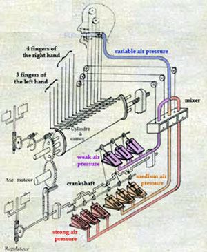

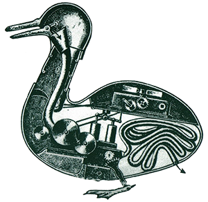

Desenvolvido no  MIT  \(Massachusetts Institute of Technology\) em 1967\, o programa de computador  Mac Hac    _[venceu](https://ingram-braun.net/erga/2017/04/the-chess-game-hubert-dreyfus-vs-mac-hack-%E2%85%B5-1967-annotated/)_   em um jogo de xadrez o filósofo  Dreyfus \,   _[importante contestador da Inteligência Artificial](https://forumdediscursus.wordpress.com/contemporanea/dreyfus-e-os-limites-da-i-a/)_  \.

Em  1997 \, o computador  IBM Deep\-Blue  \(256 co\-processadores\)  venceu três  partidas de xadrez\,  empatou duas  e  perdeu somente uma  partida\. O seu oponente era simplesmente  Garry Kasparov \, campeão mundial de xadrez\.

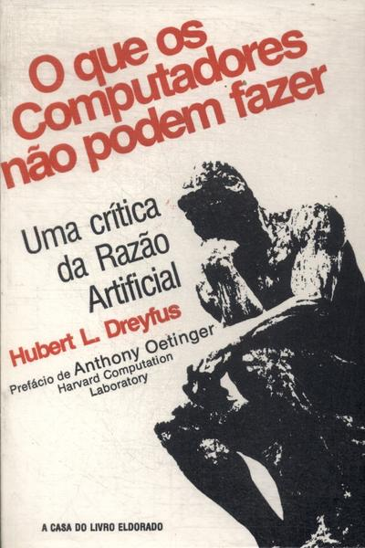

 __O Que Os Computadores Não Podem Fazer__ 

 _Uma Crítica Da Razão Artificial_ 

 __Hubert L\. Dreyfus__ 

O termo “ Inteligência Artificial ” surgiu em  1956  em uma reunião com cientistas de diferentes áreas do conhecimento que tinham interesse em construir máquinas inteligentes e em debater o modo como essas máquinas afetariam os processos existentes\.

Mesmo que o termo supracitado seja tão novo\,  várias pesquisas  que contribuíram para o desenvolvimento da IA  precederam o surgimento dos próprios computadores \.

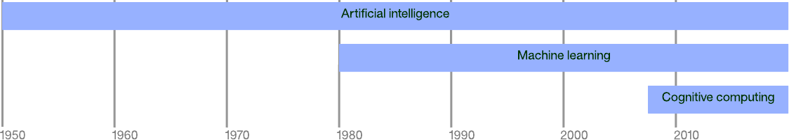

Época clássica \(1956\-1970\): 

como o objetivo era simular a inteligência humana\, buscava\-se a criação de programas com capacidade para solucionarem qualquer problema\. Isso gerou uma série de fracassos\. Um dos programas mais conhecidos é o  GPS \(General Problem Solver\) \.

A partir da década de 1950\, a IA moderna concentrou\-se no que foi chamado de IA forte\, que se referia à IA que geralmente poderia realizar qualquer tarefa intelectual que um ser humano pudesse\. A falta de progresso na IA forte acabou levando ao que é chamado de IA fraca\, ou à aplicação de técnicas de IA a problemas mais restritos\.

IA fundamental

Pesquisas anteriores a 1950 introduziram a ideia de que o cérebro consistia em uma rede elétrica de pulsos que disparavam e de alguma forma orquestravam o pensamento e a consciência\.

Alan Turing  mostrou que qualquer computação pode ser implementada digitalmente\. A ideia\, então\, de construir uma máquina que pudesse imitar o cérebro humano não poderia estar longe\.

Muitas pesquisas iniciais se concentraram nesse forte aspecto da IA\, mas esse período também introduziu os conceitos fundamentais sobre os quais todo aprendizado de máquina e aprendizado profundo são construídos hoje\.

Época romântica \(1970\-1980\): 

o objetivo era simular o comportamento humano em  situações restritas \. A  formalização matemática  passou a ser exigida para evitar as falhas cometidas na época anterior\.

Diversos sistemas especialistas foram implementados com sucesso \. Mas vários  fracassos  ocorreram devido à  subestimação  da  quantidade de informação necessária  à solução de um problema\, assim como devido à dificuldade dos sistemas especialistas lidarem com  circunstâncias novas \.

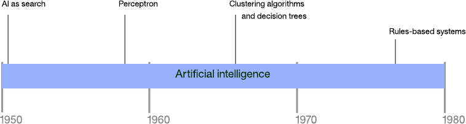

IA como pesquisa

Muitos problemas em IA podem ser resolvidos por meio de  pesquisa de força bruta  \(como pesquisa em profundidade ou amplitude\)\. No entanto\, considerando o espaço de busca para problemas moderados\, a busca básica sofre rapidamente\.

Um dos primeiros exemplos de IA como busca foi o desenvolvimento de um programa de  jogo de damas \.

Arthur Samuel  construiu o primeiro programa desse tipo na máquina de processamento eletrônico de dados IBM 701\, implementando uma otimização para pesquisar árvores chamada poda alfa\-beta\. Seu programa também registrava a recompensa por um movimento específico\, permitindo que o aplicativo aprendesse a cada jogo jogado \(tornando\-se o primeiro programa de autoaprendizagem\)\. Para aumentar a taxa de aprendizado do programa\, Samuel o programou para rodar sozinho\, aumentando sua capacidade de jogar e aprender\.

Embora você possa aplicar a pesquisa com sucesso a muitos problemas simples\, a  abordagem falha rapidamente à medida que o número de opções aumenta \.

Tome o simples jogo da velha como exemplo\. No início de um jogo\, existem nove movimentos possíveis\. Cada movimento resulta em oito contra\-movimentos possíveis\, e assim por diante\.

A árvore completa de movimentos para jogo da velha \(não otimizado para rotação para remover duplicatas\) é de 362\.880 nós\. Se você estender esse mesmo experimento mental ao xadrez verá rapidamente o lado negativo da pesquisa\.

Época moderna \(1980\-1990\): 

maior ênfase às  ferramentas  para o desenvolvimento de sistemas especialistas\, facilitando o trabalho do  usuário em criar o seu próprio sistema especialista  para tratar problemas mais específicos\.

Perceptrons

O perceptron foi um dos primeiros algoritmos de aprendizado supervisionado para redes neurais de camada única\.

Dado um vetor de recursos de entrada \, o algoritmo perceptron pode aprender a  classificar as entradas como pertencentes a uma classe específica \. Usando um  conjunto de treinamento \, os pesos e o viés da rede podem ser atualizados para classificação linear\.

O perceptron foi implementado pela primeira vez para o IBM 704 e\, em seguida\, em hardware personalizado para reconhecimento de imagem\.

Perceptrons

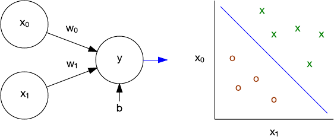

Algoritmos de agrupamento

Com perceptrons\, a  abordagem foi supervisionada \. Os usuários forneceram dados para treinar a rede e\, em seguida\, testar a rede em relação aos novos dados\.

Os algoritmos de agrupamento adotam uma abordagem diferente chamada  aprendizado não supervisionado \. Nesse modelo\, o algoritmo organiza um conjunto de vetores de recursos em clusters com base em um ou mais atributos dos dados\.

Algoritmos de agrupamento

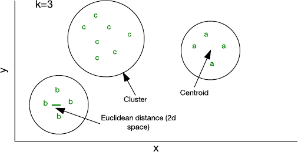

Algoritmos de agrupamento

Um dos algoritmos mais simples que você pode implementar em uma pequena quantidade de código é chamado  k\-means \.

Nesse algoritmo\,  k indica o número de clusters nos quais você pode atribuir amostras \.

Embora k\-means seja relativamente eficiente\, você deve especificar k antecipadamente\. Dependendo dos dados\, outras abordagens podem ser mais eficientes\, como agrupamento hierárquico ou baseado em distribuição\.

Árvores de decisão

Intimamente relacionada ao agrupamento está a árvore de decisão\. Uma árvore de decisão é um  modelo preditivo sobre observações  que levam a alguma conclusão\.

As conclusões são representadas como folhas na árvore\, enquanto os nós são pontos de decisão onde uma observação diverge\. As árvores de decisão são construídas a partir de algoritmos de aprendizado de árvore de decisão\, onde o conjunto de dados é dividido em subconjuntos com base em testes de valor de atributo \(através de um processo chamado particionamento recursivo\)\.

Árvores de decisão

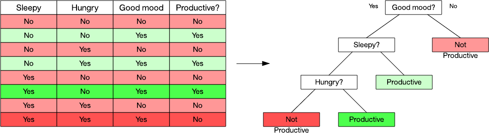

Árvores de decisão

Considere o exemplo da figura anterior\. Neste conjunto de dados\, posso observar quando alguém foi produtivo com base em três fatores\.

Usando um algoritmo de aprendizado de árvore de decisão\, podemos identificar atributos usando uma métrica \(um exemplo é o ganho de informação\)\.

Neste exemplo\, o humor é um fator primário na produtividade\, então eu divido o conjunto de dados de acordo com se "bom humor" é Sim ou Não\. O lado Não é simples: é sempre improdutivo\.

Mas\, o lado Sim exige que eu a gente divida o conjunto de dados novamente com base nos outros dois atributos\. Eu colori o conjunto de dados para ilustrar onde as observações levaram aos nós de folha\.

Sistemas baseados em regras

O primeiro sistema baseado em regras e inferência\, chamado  Dendral \, foi desenvolvido em 1965\, mas foi somente na década de 1970 que esses chamados "sistemas especialistas" atingiram seu auge\. Um sistema baseado em regras é aquele que armazena conhecimento e regras e usa um sistema de raciocínio para tirar conclusões\.

Um sistema baseado em regras geralmente consiste em um conjunto de regras\, uma base de conhecimento\, um mecanismo de inferência \(usando encadeamento de regras para frente ou para trás\) e uma interface de usuário\. Na figura a seguir\, mostramos um conhecimento \("Sócrates era um homem"\)\, uma regra \("se homem\, então mortal"\) e uma interação sobre quem é mortal

Sistemas baseados em regras

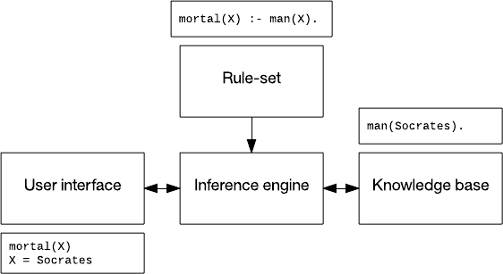

Sistemas baseados em regras

Sistemas baseados em regras têm sido aplicados ao reconhecimento de fala\, planejamento e controle e identificação de doenças\. Um sistema desenvolvido na década de 1990 para monitorar e diagnosticar a estabilidade da barragem\, chamado  Kaleidos \, ainda está em operação hoje\.

Aprendizado de máquina

O aprendizado de máquina é um  subcampo da IA ​​e da ciência da computação  que tem suas raízes na estatística e na otimização matemática\.

O aprendizado de máquina abrange técnicas de aprendizado supervisionado e não supervisionado para aplicativos de previsão\, análise e mineração de dados\. Não se restringe ao aprendizado profundo e\, nesta seção\, exploramos alguns dos algoritmos que levaram a essa abordagem surpreendentemente eficiente\.

Aprendizado de máquina

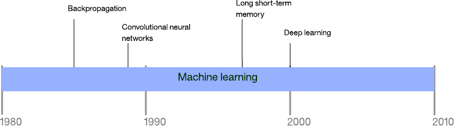

Aprendizado de máquina

O verdadeiro poder das redes neurais é sua variante multicamadas\. O treinamento de perceptrons de camada única é direto\, mas a rede resultante não é muito poderosa\.

A questão passou a ser: como podemos treinar redes com múltiplas camadas? É aqui que entra a retropropagação\.

Backpropagation 

Backpropagation é um algoritmo para treinamento de redes neurais que possuem muitas camadas\.

Funciona em duas fases\. A primeira fase é a propagação das  entradas através de uma rede neural até a camada final  \(chamada feedforward\)\. Na segunda fase\, o algoritmo  calcula um erro  e\, em seguida\,  retropropaga esse erro  \(ajustando os pesos\) da camada final para a primeira\.

Backpropagation 

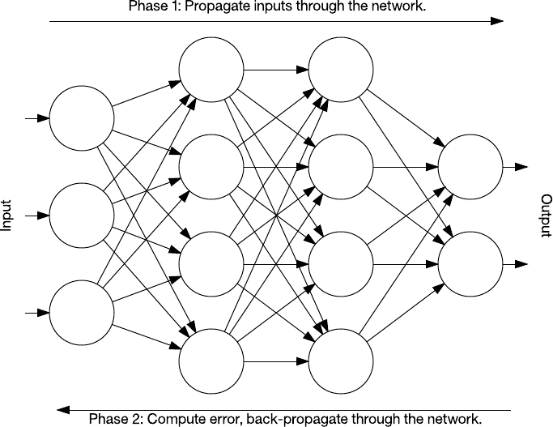

Redes neurais convolucionais

As redes neurais convolucionais \(CNNs\) são redes neurais multicamadas que se inspiram no  córtex visual animal \. A arquitetura é útil em várias aplicações\, incluindo processamento de imagens\. A primeira CNN foi criada por Yann LeCun e\, na época\, a arquitetura se concentrava em tarefas de reconhecimento de caracteres manuscritos\, como a leitura de códigos postais\.

Redes neurais convolucionais

A arquitetura LeNet CNN é composta de várias camadas que implementam a extração de recursos e\, em seguida\, a classificação\.

A imagem é dividida em campos receptivos  que alimentam uma camada convolucional que extrai características da imagem de entrada\. A próxima etapa é o  agrupamento \, que reduz a dimensionalidade dos recursos extraídos \( através da redução da amostragem \) enquanto retém as informações  mais importantes  \(normalmente por meio do agrupamento máximo\)\.

O algoritmo então executa outra etapa de  convolução e agrupamento  que alimenta um perceptron multicamada totalmente conectado\. A camada de saída final desta rede é um conjunto de nós que identificam características da imagem \(neste caso\, um nó por número identificado\)\. Os usuários podem treinar a rede por meio de retropropagação\.

Redes neurais convolucionais

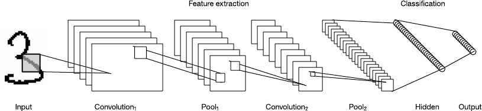

Memória de curto longo prazo \(LSTM\)

Lembre\-se da discussão sobre retropropagação de que a rede que está sendo treinada era feedforward\. Nessa arquitetura\, os usuários alimentam as entradas na rede e as propagam através das camadas ocultas para a camada de saída\.

Porém\, existem muitas outras topologias de redes neurais\. Um deles\, que investigo aqui\, permite que conexões entre nós formem um ciclo direcionado\. Essas redes são chamadas de redes neurais recorrentes e podem retroalimentar camadas anteriores ou nós subsequentes dentro de sua camada\. Essa propriedade torna essas redes ideais para dados de séries temporais\.

Memória de curto longo prazo \(LSTM\)

Em 1997\, um tipo especial de rede recorrente foi criado\, chamado de memória de longo prazo \(LSTM\)\. O LSTM consiste em células de memória que dentro de uma rede lembram valores por um curto ou longo tempo\.

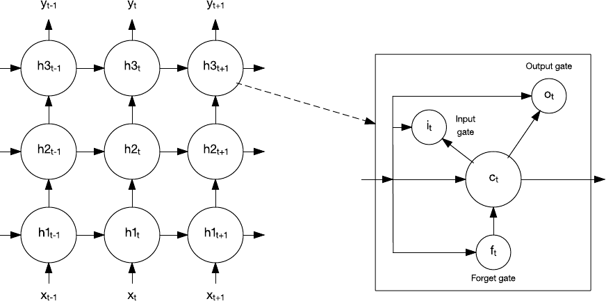

Aprendizado profundo

O aprendizado profundo é um conjunto de métodos que mudou o aprendizado de máquina de maneiras fundamentais\.

O aprendizado profundo não é um algoritmo em si\, mas sim uma família de algoritmos que implementam redes profundas com aprendizado não supervisionado\. Essas redes são tão profundas que novos métodos de computação\, como GPUs\, são necessários para construí\-las \(além de clusters de nós de computação\)\.

Aprendizado profundo

Nós exploramos dois algoritmos de aprendizado profundo até agora: CNNs e LSTMs\. Esses algoritmos foram combinados para realizar várias tarefas surpreendentemente inteligentes\.

Conforme mostrado na figura a seguir\, CNNs e LSTMs foram usados ​​para identificar e\, em seguida\, descrever em linguagem natural uma imagem ou vídeo\.

Aprendizado profundo

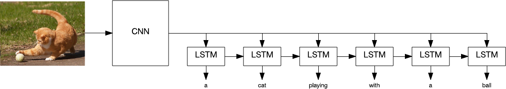

Aprendizado profundo

Algoritmos de aprendizado profundo também foram aplicados ao reconhecimento facial\, identificando  tuberculose com 96% de precisão \, veículos autônomos e muitos outros problemas complexos\.

No entanto\, apesar dos resultados da aplicação de algoritmos de aprendizado profundo\, existem problemas que ainda não foram resolvidos\.

Uma aplicação recente de aprendizado profundo para detecção de câncer de pele descobriu que o algoritmo era mais preciso do que um dermatologista certificado\. Mas\, onde os dermatologistas podem enumerar os fatores que levaram ao seu diagnóstico\, não há como identificar quais fatores um programa de aprendizado profundo usou em sua classificação\. Isso é chamado de  problema da caixa preta do aprendizado profundo \.

Aprendizado profundo

Outro aplicativo\, chamado Deep Patient\, foi capaz de prever doenças com base nos registros médicos de um paciente\. O aplicativo provou ser consideravelmente melhor na previsão de doenças do que os médicos \- mesmo para a esquizofrenia\, que é notoriamente difícil de prever\.

Assim\, mesmo que os modelos funcionem bem\, ninguém pode acessar as enormes redes neurais para identificar o motivo\.

# Áreas da Inteligência Artificial

* As principais áreas da inteligência artificial são:
  * Reconhecimento de padrões;
  * Sistemas especialistas;
  * Bases de dados inteligentes;
  * Robótica;
  * Processamento de linguagem natural;
  * Visão por computador;
  * Prova de Teoremas;
  * Jogos\.

* Reconhecimento de padrões:
  * Envolve tarefas como reconhecimento de gestos\, falas\, faces\, o ambiente\, palavras escritas e faladas\.
* Sistemas especialistas:
  * São sistemas que conseguem fornecer respostas sobre um determinado domínio a um usuário utilizando para isso uma base de conhecimento\. Área muito popular em IA cujos sistemas auxiliam a tomada de decisão\.

* Bases de dados inteligentes:
  * Utiliza técnicas de mineração de dados visando adicionar às bases de conhecimento a habilidade de raciocinar\, possibilitando a geração de resultados novos\.
* Robótica:
  * Busca embutir nos dispositivos alguma inteligência para que os mesmos sejam capazes de tomar decisões que podem ser importantes em algum momento\. Robôs podem ser utilizados em ambientes perigosos ou que exijam força ou precisão\.

* Processamento de linguagem natural:
  * Visa dotar as máquinas da capacidade de aprender línguas\.
* Visão por computador:
  * Tem o objetivo de desenvolver sistemas que consigam extrair informações à partir de imagens do ambiente\.

* Prova de Teoremas:
  * Consiste em dotar as máquinas em definir sequências lógicas de ações que levam uma hipótese \(situação inicial\) à tese \(objetivo final\)\.
* Jogos :
  * Atualmente diversos jogos utilizam técnicas de IA para que os personagens controlados pela máquina possam ajustar o seu comportamento em acordo com o tipo de comportamento do usuário ou serem capazes de aprender com as derrotas sofridas\.

# Teste de Turing

Proposto por Alan Turing em um artigo em 1950\, é o teste clássico para determinar se uma máquina possui inteligência ao nível humano\.

O teste consiste em colocar em um ambiente  dois seres humanos B e C  e um  computador A  de forma que  não exista comunicação entre A\, B e C \.

No teste\, o  humano C  tem o papel de  interrogador  e o seu objetivo é  analisar  as respostas de A e B e descobrir  qual deles é o computador \.

Se para diferentes combinações de humanos B e C  não for possível identificar se B ou C é humano \, A passou no teste\.

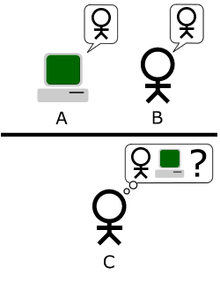

# Heurísticas

Estratégias para solução de problemas de  maneira mais rápida  que a  investigação de todas as respostas possíveis \.

Imagine que você está  perdido em uma floresta  e deseja  encontrar água\. 

O que você faria?

Você seguirá na direção das partes mais baixas do terreno\, pois será maior a probabilidade de encontrar lagos e rios nesses locais \.

Isso acelera a busca\, pois não será mais necessário procurar no topo de montanhas e em cima das árvores\, por exemplo\.

# Desafio final da IA

Uma característica humana importante\, talvez seja o desafio final da Inteligência Artificial\.

Essa característica é o  bom senso \, que permitiria que um computador pudesse\, por exemplo\,  entender diferentes sentidos para uma mesma resposta observando a entonação usada pela pessoa \, no caso\, por exemplo\, de frases pronunciadas com sarcasmo\.

