<style>
mark{
    color:red;
}

.center {
  display: block;
  margin-left: auto;
  margin-right: auto;
}

.purple{
  color:#7030A0;
}

.destaque{
  color:#7030A0;
}

p{
  margin: 4rem 0;
}

.break{
  display: block;
  margin:80px 0px
}
</style>
# Métodos de pesquisa

<br>

# Pesquisa sequencial

Pesquisa sequencial
  * Elementos pesquisados sucessivamente
  * Comparação determina se o elemento foi encontrado ou não
  * Exemplo: buscar 4 \(vetor ou lista encadeada\)


Tempo de busca: O\(n\)

Comparações: \(n \+ 1\) / 2

Pesquisa sequencial em vetor não ordenado

Necessário pesquisar em todo o vetor:

``` csharp

int Busca(int v[], int chave)
{
    int i;
    i = 0;
    while (i < v.Length && chave != v[i])
        i = i + 1;
    if (chave == v[i])
        return i;
    else
        return -1;
}

```
<br>


Tempo de busca: O\(n\)

Comparações: \(n \+ 1\) / 2

<br>

Pesquisa sequencial em vetor ordenado \(crescente\):

  * Caso encontre um número maior que o buscado\, pare\.

<br>

``` csharp

int Busca(int v[], int chave)
{
    int i;
    i = 0;
    while (i < v.Length && chave > v[i])
        i = i + 1;
    if (chave == v[i])
        return i;
    else
        return -1;
}

```
<br>


Ainda assim...

Tempo de busca: O\(n\)

Comparações: \(n \+ 1\) / 2

<br>


# Pesquisa Binária

<br>


Pesquisa binária em vetor ordenado \(crescente\):

<br>

``` csharp

int BuscaBin(int v[], int chave)
{
    int esq = 0, dir = v.Length - 1;
    int pos = (esq + dir) / 2;
    while (chave != v[pos] && esq <= dir)
    {
        if (chave < v[pos])
            dir = pos - 1;
        else
            esq = pos + 1;
        pos = (esq + dir) / 2;
    }
    if (chave == v[pos])
        return pos;
    else
        return -1;
}

```
<br>


Tempo de busca: O\(log\(n\)\)

Comparações: \(log\(n\) \+ 1\) / 2

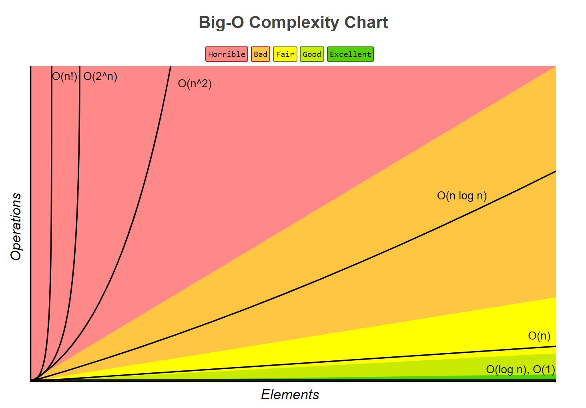

<br>

<br>


# Árvores: Motivação

<br>


Qual estrutura de dados o Windows Explorer deve utilizar para gerenciar os arquivos?

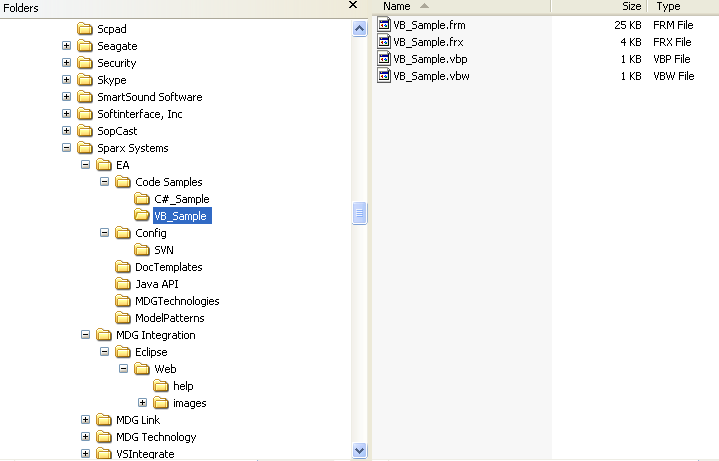

<br>


Ex: Hierarquia Universitária

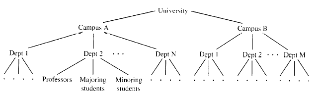

<br>

Representação da expressão aritmética:

\(a \+ \(b \*\( \(c / d\) \- e\)\)\)

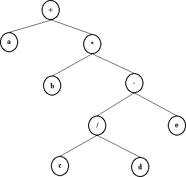


__Listas ligadas__

  * São mais flexíveis do que vetores;
  * Possuem acesso sequencial;
  * São estruturas lineares sendo difícil utilizá\-las para organizar representação hierárquica de objetos\.

__Pilhas e filas__
  * Refletem alguma hierarquia;
  * Mas são limitadas somente a uma dimensão\.

__Árvore__
  * Estrutura criada para superar limitações de listas ligadas\, pilhas e filas;
  * Consiste de nós e de arcos;
  * São representadas com a raiz no topo e as folhas na base \(diferente de árvore natural\)\.

<br>


# Árvores: Representações Gráficas

<br>


Alinhamento dos nós

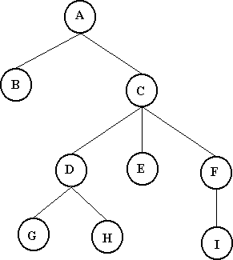

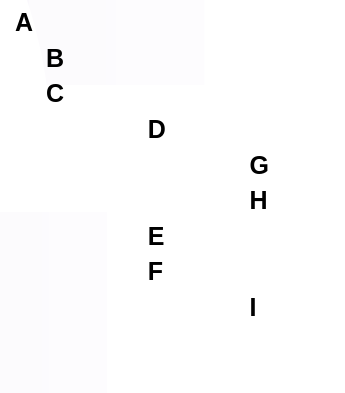

Parênteses aninhados

\(  A \(B\) \( C \(D \(G\) \(H\)\) \(E\) \(F \(I\)\) \)  \)

Diagramas de inclusão

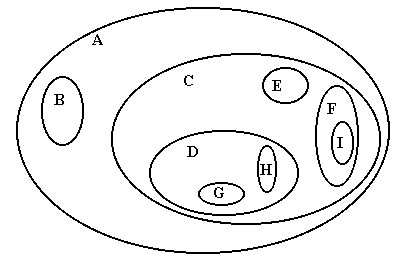


<br>


<br>

## Árvores: Definições

<br>


<span class="destaque">Nó</span>: Elemento que contém a informação

<span class="destaque">Arco</span>: Liga dois nós

<span class="destaque">Pai</span>: nó superior de um arco

<span class="destaque">Filho</span>: nó inferior de um arco

<span class="destaque">Raiz</span> \(nó topo\)
  * Não possui ancestrais \(não tem nó pai\)
  * Só pode ter filhos

<span class="destaque">Folhas</span>
  * nós das extremidades inferiores
  * Não têm nós filhos \(ou melhor\, seus filhos são estruturas vazias\)

### Definição recursiva de árvore
  * 1\. Uma estrutura vazia é uma árvore vazia\.
  * 2\. Se t1\, \.\.\.\, tk são raízes de árvores disjuntas\, então a estrutura cuja raiz r tem como suas filhas as raízes t1\, \.\.\.\, tk também é uma árvore\.
  
  


  * 3\. Somente estruturas geradas pelas regras 1 e 2 são árvores\.

<br>


## Graus dos nós

<br>


Grau de um nó é o <span class="destaque">número de subávores</span> de um nó\.

Grau de uma árvore \(aridade\): é definido como sendo igual ao grau máximo entre todos os nós da árvore\.


  

Cada nó tem que ser atingível a partir da raiz\, através de uma sequência única de arcos chamada de <span class="destaque">caminho</span>\.
O <span class="destaque">comprimento</span> do caminho é o <span class="destaque">número de arcos do caminho</span>

<span class="destaque">Nível de um nó</span> é a distância \(em arcos\) entre o nó e a raiz da árvore\. A raiz tem nível igual a 0\.

<br>

Na figura abaixo\, o nó A tem nível 0; os nós B\, C\, D e E têm nível 1 e os nós F\, G e H têm nível 2\.

  * O caminho de A até H tem comprimento 2:

  


<span class="destaque">A altura</span> de um nó x é a distância entre x e o seu descendente mais afastado \(folha\)\. Mais precisamente\, a altura de x é o número de arcos do mais longo caminho que vai de x até uma folha\.

Altura \(ou profundidade\) da árvore é o nível do nó folha que tem o mais longo caminho até a raiz\.
  * A árvore vazia é uma árvore de altura \-1\, por definição\.
  * Uma árvore com um único nó tem  altura 0\.
    * O nó é raiz e folha ao mesmo tempo\.

Toda árvore com n>1 nós possui no mínimo 1 e no máximo n\-1 folhas\.

Exemplos de alturas da árvore T:

  


Pela definição\, a altura de uma subárvore de uma folha é \-1\. Portanto\, a altura de qualquer folha é 0 \(zero\)\.

Exemplo de níveis e altura da árvore

<br>

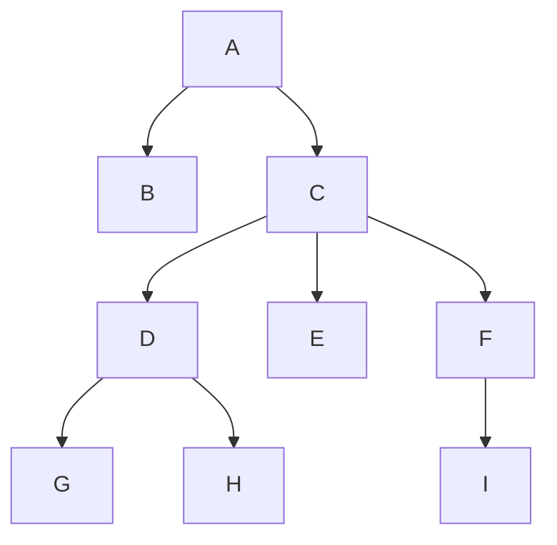
<br>

| NÍVEIS |  |
| :-: | :-: |
| A | 0 |
| B, C | 1 |
| D, E, F | 2 |
| G, H, I | 3 |


## Árvore Ordenada
Os filhos de cada nó estão ordenados \(assume\-se ordenação da <span class="destaque">esquerda para a direita</span>\) \.

<br>

<span class="destaque">Ordenada</span>: 


<br>
<span class="destaque">Desordenada</span>:

<br>

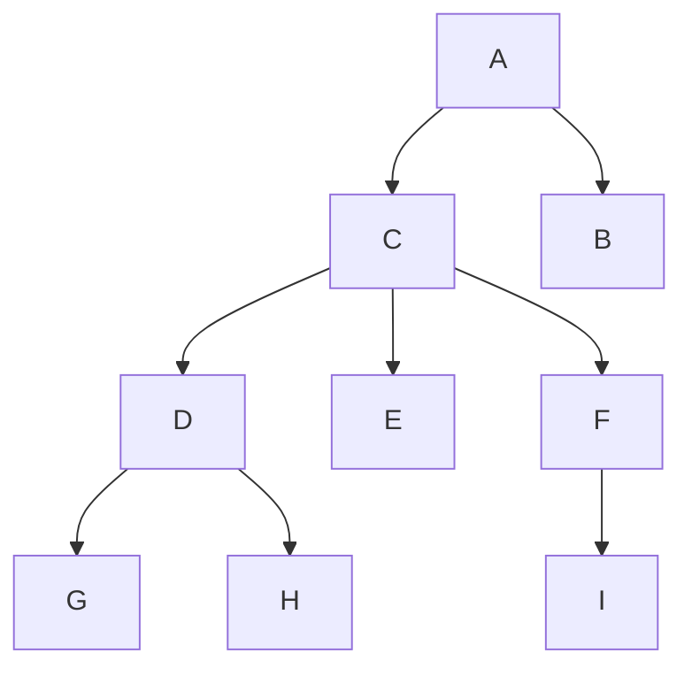
<br>

A definição de árvore não impõe qualquer condição sobre o número de filhos de um nó:
  * Pode variar de 0 a qualquer inteiro;
Árvores são muito utilizadas em sistemas gerenciadores de banco de dados\.


<br>

# Árvores Binárias

<br>

Uma árvore binária é uma árvore cujos nós têm no <span class="destaque">máximo\, dois filhos\</span>, portanto\, a árvore binária tem grau 2\.

Em uma árvore binária cada filho é designado como filho à esquerda ou filho à direita \(ou Nó filho ESQUERDO e Nó filho DIREITO\)\.

<br>

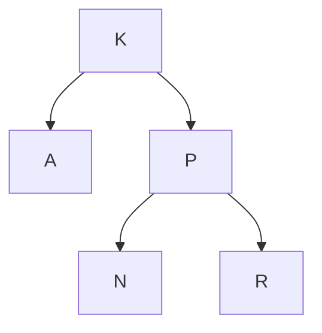
<br>

<br>

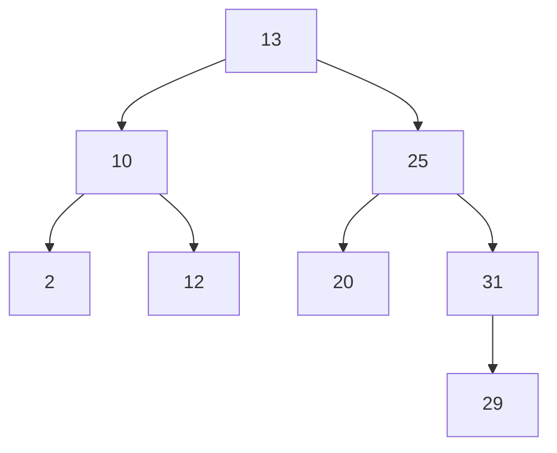
<br>
Definição: Uma  _árvore binária T_  é um conjunto finito de elementos denominados  _nós_  ou  _vértices_ \, tal que:

- Se T = ∅\, a árvore é dita vazia\, ou

- existe um nó especial r\, chamado raiz de T\, e os nós restantes podem ser divididos em dois subconjuntos disjuntos\, TrL e TrR\, correspondentes às subárvores a esquerda e a direita de r\, respectivamente\, que também são árvores binárias\.

<br>

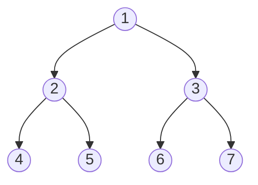
<br>


<span class="destaque">Árvore estritamente binária:</span>

 * Cada nó possui 0 ou 2 filhos\.
  
  <br>
  
  ``` mermaid
  
  graph TB;
    A((A))-->B((B))
    A-->C((C));
    C-->E((E))
    E-->H((H))
    E-->I((I))
    C-->F((F))
  
  ```
  <br>
  

<span class="destaque">Árvore binária completa:</span>

  * Se v é um nó tal que alguma subárvore de v é vazia\, então v se localiza ou no último \(maior\) ou no penúltimo nível da árvore\.

<br>

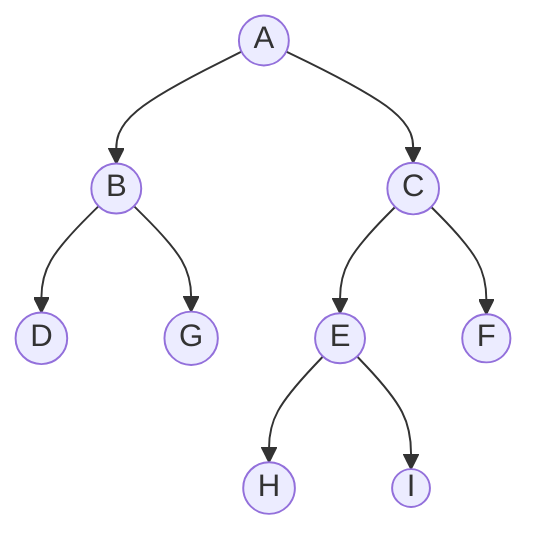
<br>


<span class="destaque">Árvore binária cheia</span>

  * Se v é um nó tal que alguma subárvore de v é vazia\, então v se localiza no último \(maior\) nível da árvore\. Neste caso\, v é um nó folha\.

<br>

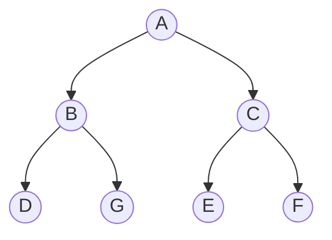
<br>


Em uma árvore binária cheia\, o número de nós do nível i é igual a 2i\.

Consequentemente\, em qualquer árvore binária existe no máximo 2i  nós no nível i\.


<br>

## Representações de Árvores Binárias

<br>

### Representação sequencial como matriz:

| Índice | Info | Esquerda | Direita |
| :-: | :-: | :-: | :-: |
| 0 | 13 | 4 | 2 |
| 1 | 31 | 6 | -1 |
| 2 | 25 | 7 | 1 |
| 3 | 12 | -1 | -1 |
| 4 | 10 | 5 | 3 |
| 5 | 2 | -1 | -1 |
| 6 | 29 | -1 | -1 |
| 7 | 20 | -1 | -1 |

  * Nó: estrutura com um campo de informação e dois indicadores para os filhos a esquerda e a direita
  * A raiz é alocada na primeira célula \(de índice 0\)
  * Indicador igual a \-1 corresponde a inexistência de filho naquela direção\.

> Exercício: desenhar a árvore representada acima\.

> Qual o problema desta implementação?

### Representação encadeada:

Neste caso\, um nó será constituído por três campos:
  * Campo de informação\.
  * Ponteiro para nó filho a esquerda\.
  * Ponteiro para nó filho a direita\.

Esquematicamente:

<br>

<br>

## Percurso em árvores binárias

Percurso corresponde a uma <span class="destaque">visita sistemática</span> a cada um dos nós da árvore

Esta é uma das operações básicas relativas à manipulação de árvores

Uma árvore é essencialmente uma estrutura não\-sequencial

Pode ser utilizada em aplicações que demandem <span class="destaque">acesso direto</span>

Em qualquer tipo de aplicação é imprescindível <span class="destaque">conhecer métodos eficientes para percorrer toda a estrutura</span>\.

  * Exemplo: para listar conteúdo de um arquivo é necessário utilizar algoritmos para percurso\.


Para percorrer a árvore deve\-se\, então\, visitar cada um de seus nós\.

* <span class="destaque">Visitar</span> um nó significa  __operar__  com a informação do nó\.
  * Por exemplo: imprimir\, atualizar informações etc\.

* <span class="destaque">Percorrer</span> uma árvore significa visitar os seus nós exatamente uma vez
Contudo\, durante um percurso pode\-se passar várias vezes por alguns nós sem visitá\-los\.

__Passos básicos do percurso__

* Passo básico:  _visitar a raiz_  de cada subárvore da árvore em questão\.

Pode\-se assumir que o percurso seja feito como uma combinação de percursos nas subárvores\.

  * Percorrer as subárvores da esquerda e da direita da raiz\.

As três <span class="destaque">operações</span> que compõem o algoritmo são:
  * __Visitar__  a raiz\,  __percorrer__  a subárvore da esquerda e  __percorrer__  a subárvore da direita\.

Questão: definir a ordem em que estas operações são realizadas de acordo com o problema\.

## Percurso em profundidade

<span class="destaque">Algoritmo</span>

  * Seguir tanto quanto possível à esquerda \(ou direita\);
  * Então mover para trás até a primeira encruzilhada;
  * Seguir um passo para direita \(ou esquerda\);
  * Novamente\, seguir tanto quanto possível para a esquerda \(ou direita\);
  * Repetir o processo até que todos os nós tenham sido visitados\.

Envolve 3 tarefas:
  * V – Visitar um nó;
  * L – Percorrer subárvore esquerda \(left\);
  * R – Percorrer subárvore direita \(right\)\.

3\! possibilidades: VLR\, LVR\, LRV\, VRL\, RVL\, RLV\.

  * VLR: percurso em pré\-ordem \(ou pré\-fixado\)
  * LVR: percurso em ordem simétrica \(central ou in\-ordem\)
  * LRV: percurso em pós\-ordem \(ou pós\-fixado\)

__Percurso em pré\-ordem \(pré\-fixado\)__
<br>

Passos:
  * Visitar a raiz;
  * Percorrer sua subárvore esquerda\, em pré\-ordem;
  * Percorrer sua subárvore direita\, em pré\-ordem\.

<br>

<br>

* Exemplo: ABDGCEHIF

__Percurso em in\-ordem ou central__
<br>

Passos:
  * Percorrer sua subárvore esquerda\, em in\-ordem;
  * Visitar a raiz;
  * Percorrer sua subárvore direita\, em in\-ordem\.

<br>

<br>

* Exemplo: DGBAHEICF

__Percurso em pós\-ordem__
<br>

Passos:
  * Percorrer sua subárvore esquerda\, em in\-ordem;
  * Percorrer sua subárvore direita\, em in\-ordem;
  * Visitar a raiz\.

<br>

<br>

* Exemplo: GDBHIEFCA


> Aplicação 1

Apresentar a sequência de nós visitados ao percorrer em profundidade a árvore binária a seguir em pré\-ordem \(pré\-fixado\)\, em pós\-ordem \(pós\-fixado\) e em in\-ordem \(central\)\.


<br>

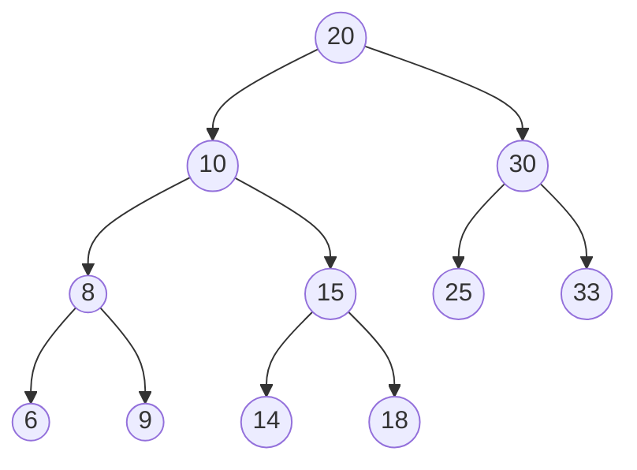
<br>

## Percurso em extensão \(largura\)

Corresponde a visitar cada nó começando no nível mais alto \(ou mais baixo\) e movendo para baixo \(ou para cima\) nível a nível\, visitando nós em cada nível da esquerda para a direita \(ou da direita para a esquerda\)\.

<br>

<br>

Exemplo: ABCDEFGHI

Usa\-se uma fila para a sua implementação\.
Por exemplo\, para um percurso em extensão de cima para baixo\, da esquerda para a direita usando fila\.
  * Entra com o nó raiz na fila;
  * Nó no início da fila é visitado \(sai da fila\);
  * Quando um nó é visitado\, seus filhos \(se houverem\) são colocados no final da fila\.

<br>

<br>


Para um nó j no nível n\, seus filhos estão no nível n \+ 1;
Após a visita do nó j\, seus filhos são colocados no final da fila;
  * Portanto\, eles só serão visitados depois que todos os nós do nível n forem visitados\.
Assim a restrição de que todos os nós no nível n precisam ser visitados antes de visitar quaisquer nós no nível n \+ 1 será satisfeita\.

Algoritmo:
  * Se árvore não está vazia
    * Coloca nó raiz na fila
    * Enquanto tem nó na fila
      * Visitar o nó do início da fila \(excluir o nó da fila\);
      * Se tem filho à esquerda
        * Colocá\-lo na fila;
      * Se tem filho à direita
        * Colocá\-lo na fila;


> Aplicação 2 

– Apresentar o caminho percorrido na árvore binária a seguir\, realizando um percurso em extensão\.


<br>

> Exercícios

- Escrever uma função para calcular e retornar a altura de uma árvore binária\.

- Desenvolver um algoritmo para realizar o percurso em extensão em uma árvore binária de caracteres e imprimir as informações de todos os seus nós\.
