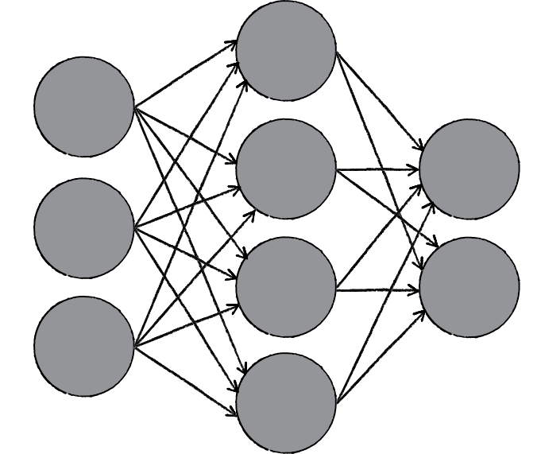

<style>
mark{
    color:red;
}

.center {
  display: block;
  margin-left: auto;
  margin-right: auto;
}

.purple{
  color:#7030A0;
}

.destaque{
  color:#7030A0;
}

p{
  margin: 4rem 0;
}

.break{
  display: block;
  margin:80px 0px
}

.nodeLabel span {
    color: darkorange !important;
}

.container-center{
  display:flex;
  justify-content: center;
}
</style>

# Introdução

O desenvolvimento das redes neurais artificiais teve início nos <span class="destaque">anos 40</span>.

Após isso as redes neurais ficaram um bom tempo desacreditadas até que a sua popularidade aumentou significativamente nos <span class="destaque">anos 80</span>.

O aumento na popularidade ocorreu devido à descoberta de novas técnicas e devido ao avanço tecnológico do hardware.

Algumas redes neurais artificiais são modelos de redes neurais biológicas.

Historicamente, a inspiração para as redes neurais artificiais veio do desejo de se produzir sistemas artificiais capazes de realizar processamentos sofisticados ou até mesmo inteligentes.

Esses processamentos são similares aos que os humanos processam rotineiramente. Outra inspiração das redes neurais artificiais era o desejo de aumentar o conhecimento humano sobre o funcionamento do cérebro.

* A maioria das redes neurais artificiais são treinadas com um conjunto de dados.
  * De forma semelhante a em que uma criança aprende a reconhecer um cachorro <span class="destaque">recebendo exemplos</span> do que são cachorros.
* Após serem treinadas, as redes neurais artificiais passam a possuir alguma capacidade de generalização.
  * De forma semelhante ao que acontece com uma criança que consegue reconhecer como sendo um cachorro um elemento que <span class="destaque">não estava em seu conjunto de treinamento</span>.
<br>

* Computadores precisam ser programados explicitamente
  * É necessário analisar o problema a ser resolvido
  * É necessário escrever o código do programa em uma linguagem de programação

<br>

* Redes neurais artificiais aprendem por exemplos
  * Não existe a necessidade de uma descrição explícita do problema
  * A rede neural se auto adapta durante um período de treinamento. Após o treinamento suficiente, uma rede neural consegue relacionar os dados do problema com as soluções, sendo capaz de fornecer uma solução viável para um novo problema.
  * É capaz de generalizar ou trabalhar com dados incompletos.

## Algumas Aplicações

* Classificação
  * Marketing: padrão de preferências do consumidor
  * Defesa: classificação de imagens de radares e sonares
  * Agricultura: classificação de frutos
  * Medicina: classificação de imagens por ultra-som e eletrocardiograma

* Reconhecimento e identificação
  * Informática e telecomunicações: reconhecimento de fala, visão e escrita
  * Finanças: verificação de assinatura e verificação de notas

* Avaliação
  * Engenharia: monitoramento e controle de inspeção de produtos
  * Segurança: detecção de movimento, análise de imagem de vigilância, correspondência de impressão digital.

* Predição (previsão)
  * Finanças: taxa de câmbio e previsão do mercado de ações.
  * Agricultura: previsão da produção agrícula
  * Marketing: previsão de vendas
  * Meteorologia: previsão do tempo

<br> 

# Neurônio Biológico


O cérebro é uma coleção de cerca de 10 bilhões de neurônios interligados.

Cada neurônio é uma célula que usa reações bioquímicas para receber, processar e transmitir informações.

Cada terminal está conectado a outros neurônios através de uma pequena lacuna chamada sinapse.

A árvore dendrítica de um neurônio está conectada a milhares de neurônios vizinhos. 

Quando um desses neurônios dispara, uma carga positiva ou negativa é recebida por um dos dendritos. 

As forças de todas as cargas recebidas são somadas através dos processos de soma espacial e temporal.

<br> 

# Neurônio Artificial


Um neurônio artificial é uma unidade simples de processamento que recebe uma ou mais entradas e produz uma saída.

Em um neurônio artificial, cada `entrada` está associada a um `peso` que modifica a `força` de cada entrada.

O processamento que ocorre no neurônio é a <span class="destaque">soma de todas as entradas</span> e o cálculo da saída que <span class="destaque">será transmitida</span>.

<br> 

## Bias

Além das entradas xi, existe a opção de utilizar uma entrada extra, conhecida como Bias ou Viés.

Essa entrada possui o valor 1 e é útil em várias situações.

Utilizando o bias, o processamento interno do neurônio ficaria assim:


## Funções de Ativação


# Métodos de Treinamento

* Treinamento supervisionado
  * Provê <span class="destaque">exemplos da saída</span> desejada para cada entrada.
  * A aplicação <span class="destaque">compara</span> a saída encontrada com a saída desejada e ajusta os pesos que controlam a rede.
  * O conjunto de exemplos utilizados no treinamento da rede é chamado <span class="destaque">conjunto de treinamento</span>.
  * A rede é treinada com o conjunto de treinamento várias vezes, até que não ocorram mais erros ou que o <span class="destaque">percentual de erros esteja em um patamar aceitável</span>.

<br>

* Treinamento não supervisionado
  * São fornecidas as entradas para a rede, mas <span class="destaque">não são</span> fornecidas as saídas desejadas.
  * O sistema precisa decidir quais características serão utilizadas para <span class="destaque">agrupar os dados de entrada</span>. Isso é frequentemente referenciado como auto-organização ou adaptação.

<br>

# Perceptron

Rede neural artificial que usa treinamento supervisionado.

Foi criada por Frank-Rosemblat em 1957.

É a rede neural artificial mais conhecida.

Possui algumas limitações, mas é <span class="destaque">simples de implementar</span> e tem muito valor histórico.

A primeira parte do processamento do neurônio é geralmente indicada com uma variável chamada net:


O aprendizado acontece alterando os valores dos pesos <span class="destaque">w</span> à partir do erro <span class="destaque">&delta;</span> da rede.

O erro da rede é calculado como a diferença entre a saída desejada e a saída do neurônio:


Onde <span class="destaque">y<sub>d</sub></span>  é a saída desejada e <span class="destaque">y</span>   é a saída atual do neurônio.

Os pesos são alterados fazendo:


Onde <span class="destaque">n</span>  é a taxa de aprendizado.

  * Valor entre [0,1].
  * Deve ser baixo e próximo de zero.
  * Controla a velocidade em que os pesos serão ajustados a cada passo do treinamento.
  * Valores muito baixos podem fazer com que a rede demore a convergir. Valores muito altos podem causar oscilações.

<br>

O Perceptron é uma representação, através de código, de um neurônio.

Passos do neurônio:

1- Receber entradas através dos detritos

2- Processar as entradas dentro do neurônio (algoritmo)

3- Enviar uma saída através do axônio


Bem, a rede neural (ou neural network em inglês), temos a combinação de vários perceptrons (vários neurônios)



<br>

# Prática: O Perceptron

## O Problema

Ele deve receber duas entradas, vamos chamá-las de <span class="destaque">X1</span> e <span class="destaque">X2</span> (inputs), processá-las e retornar uma saída <span class="destaque">Y1</span> (classe).

Ou seja, nosso perceptron deve resolver um <span class="destaque">problema de classificação</span>.

Dado duas entradas ele deve responder uma saída que corresponde a uma classe, de prefêrencia a correta.


Nosso problema é a <span class="destaque">classificação dos pontos</span>.

Nosso perceptron deve classificar os pontos entre abaixo da seta (classe 1) ou acima da seta (classe 2).


Vamos aos passos do algoritmo:

Pense em um dos desses pontos (qualquer um), ele é representado no plano por dois números (`X` e `Y`).

Esses pontos serão as <span class="destaque">entradas do perceptron</span>.

A saída do perceptron deverá ser a um número que represente sua <span class="destaque">classificação</span> (se pertence ao grupo dos acima da linha ou do grupo dos abaixo da linha).

Caso nosso perceptron responda errado, iremos informar a ele o valor correto para ele se <span class="destaque">auto ajustar</span>.

Caso ele responda certo, também iremos informá-lo para se auto ajustar.

<br>

## Prática: Componentes do Perceptron

Além de nossas entradas `X` e `Y`, nosso perceptron também tem `weight x` e `weight y`.

Esses dois componentes são utilizados para <span class="destaque">pesar nossas entradas</span>.

Eles serão os itens <span class="destaque">passíveis de ajustes</span> conforme o resultado e feedback do nosso programa.


<br>

## Prática: O Algoritmos do Perceptron

Passo-a-passo do algoritmo

  * A formula: `Y = X0 * W0 + X1 * W1`
  * Função de ativação: Sign(n)
    * if (n >= 0) return +1;
    * else return -1;
    * Caso número seja positivo ou igual a zero = +1
    * Caso contrário será -1
  * Inicialização dos weights randomicamente com valores entre 0 e 1

1 - Vamos criar uma pasta vazia chamada de perceptron, nela vamos criar três arquivos.
  * index.html
  * sketch.js onde irá rodar nosso programa, inicialização de variáveis, main(), etc.
  * perceptron.js, onde iremos escrever o código do perceptron
  * point.js será nossa representação lógica do ponto no plano cartesiado

Index.html

<br>

``` html
<head>
    <meta charset=pt-bf"UTF-8">
    <meta http-equiv="X-UA-Compatible" content="IE=edge">
    <meta name="viewport" content="width=device-width, initial-scale=1.0">
    <title>Perceptron</title>
    <!-- As duas primeiras dependências são necessárias para algumas
 funções de cálculo como o método random() e map() e 
 também para nos ajudar a desenhar na tela -->
    <script language="javascript" type="text/javascript" 
src="https://cdnjs.cloudflare.com/ajax/libs/p5.js/0.6.0/p5.min.js"></script>
    <script language="javascript" type="text/javascript" 
src="https://cdnjs.cloudflare.com/ajax/libs/p5.js/0.6.0/addons/p5.dom.min.js"></script>
    <script src="point.js"></script>
    <script src="perceptron.js"></script>
    <script src="sketch.js"></script>
</head>

```
<br>

<br>

``` js

//perceptron.js

class Perceptron {
    weights = [0, 0];
    constructor() {
        //inicializando os weights com valores random
        for(let i = 0; i < this.weights.length; i++) {
            this.weights[i] = random(-1, 1)
        }
    }

   //inputs --> entrada array de duas posiçoes (X1 e X2)
     guess(inputs) {
         let sum = 0;
         // aplicando a formula (Y = X1 * W1 + X2 * W2)
         for(let i = 0; i < this.weights.length; i++) {
             sum += inputs[i] * this.weights[i];
         }
         const output = sign(sum);
         return output;
     }
 
}

// Função de ativação
function sign(num) {
    return num >= 0 ? 1 : -1;
}


```
<br>

<br>

``` js

// sketch.js

let perceptron;
function setup() {
    createCanvas(550, 550);
    perceptron = new Perceptron();
    const inputs = [-1, 0.5];
    const guess = perceptron.guess(inputs);
    console.log(`resultado ${guess}`);
}
function draw() {
}


```
<br>


## Testando o perceptron

Preparando para testar nosso perceptron com uma massa maior - O Dataset.

Nosso <span class="destaque">dataset</span> (ou massa de dados) terá uma série de pontos, já com label (vamos saber de ante mão a classificação correta) e passar para nosso perceptron classificar com o guess().

Nossas entradas estão entre -1 e 1, por exemplo -1, 0.2, 0.993 e assim por diante.

<br>

``` js

//point.js
class Point {
    x = 0;
    y = 0;
    label = 0;
    constructor(x, y) {
        this.x = x;
        this.y = y;
        this.label = this.getLabel();
    }

    getLabel() {
        if(this.x > this.y) {
            return 1;
        }
        else {
            return -1;
        }
    }
    getPixelX() {
        const px = map(this.x, -1, 1, 0, width);
        return px;
    }
    getPixelY() {
        const py = map(this.y, -1, 1, height, 0);
        return py;
    }
    show() {
        stroke(0);
        if(this.label === 1) {
            fill(0);
        }
        else {
            fill(255);
        }
        const px = this.getPixelX();
        const py = this.getPixelY();
        ellipse(px, py, 22, 22);
    }
    debug() {
        console.log(`label: ${this.label} x ${this.x} y ${this.y}`)
    }
}

```
<br>


Utilizando a biblioteca p5.js só precisamos declarar dois métodos `setup()` e `draw()`.

`setup()` é onde iremos inicializar nossas variáveis.

`draw()` é onde manipulamos nossas variáveis e realizamos o desenho na tela.

<br>

``` js
//sketch.js

let points = new Array(100);

function setup() {
    createCanvas(550, 550);
      for(let i = 0; i < points.length; i++) {
        points[i] = new Point(random(-1, 1), random(-1, 1));
    }
}

function draw() {
    background(255);
    for(let i = 0; i < points.length; i++) {
        points[i].show();
    }
}


```
<br>


O que vemos? Um série de pontos, alguns brancos outros pretos. Agora, perceba o padrão, veja que podemos traçar uma linha separando os círculos de cada cor.

Os brancos pertencem a classificação 0 e os pretos a classificação 1.


<br>

## Prática:Feedback e classificação para nosso perceptron

Agora que temos os valores corretos, o que temos que fazer é informar ao perceptron se ele errou, e quão errado foi, para se autocorrigir


<br>

<span class="destaque center">ERROR = DESIRED OUTPUT - GUESS OUTPUT</span>


Lembre-se, a ideia é encontrar os weights ótimos, com essa formula podemos ajustar para chegar lá.

Uma das maneiras é a utilização do algoritmo de gradient descent, mas vamos utilizar um algoritmo um pouco mais simples nesse momento.


Nossa formula:

<span class="destaque center"> W0 =  error * X0 </span>

Nosso processo será:

  * 1 - Prover ao perceptron inputs que já sabemos a resposta
  * 2 - Perguntar ao perceptron a resposta
  * 3 - Computar o erro (acertou ou error)
  * 4 - Ajustar o Weigths de acordo com o erro
  * 5 - Retornar ao primeiro passo e repetir

<br>

``` js

//perceptron.js

class Perceptron {
    weights = [];
    //learning rate
    lr = 0.1;

    constructor(numberWeigths) {
        this.weights = new Array(numberWeigths);
        for(let i = 0; i < this.weights.length; i++) {
            this.weights[i] = random(-1, 1)
        }
    }   
    train(inputs, target) {
        const guess = this.guess(inputs);
        const error = target - guess;
        //ajustar todos weights
        for(let i = 0; i < this.weights.length; i++) {
            // lr é nosso Learning Rate. Isso resolve o problema de over shoot (ajustar demais).
            this.weights[i] += error * inputs[i] * this.lr;
        }
    }
}

```
<br>

<br>

``` js

//sketch.js
let perceptron;
let points = new Array(100);
function setup() {  
    createCanvas(550, 550);
    perceptron = new Perceptron(2);
    for(let i = 0; i < points.length; i++) {
        points[i] = new Point(random(-1, 1), random(-1, 1));
        //points[i].debug();
    }
}

function draw() {  
    background(255);
    for(let i = 0; i < points.length; i++) {
        points[i].show();
    }
    noStroke();
    for(let i = 0; i < points.length; i++) {
        const pt = points[i];
        const inputs = [pt.x, pt.y];
        const target = pt.label;
        const guess = perceptron.guess(inputs);
        if(guess == target) {
            fill(0, 255, 00);
        }
        else {
            fill(255, 0, 0);
        }
        ellipse(pt.getPixelX(), pt.getPixelY(), 15, 15);
    }
    drawLine();
    trainSinglePoint();
}

function drawLine() {  
    stroke(0);
    line(0, height, width, 0);
}

let trainningIndex = 0; 
 
function trainSinglePoint() {  
    const pt = points[trainningIndex];
    const inputs = [pt.x, pt.y];
    perceptron.train(inputs, pt.label);
    trainningIndex++;
    if(trainningIndex == points.length) {
        trainningIndex = 0;
    }
}

```
<br>

<br>

## Prática:O Bias (terceiro elemento)

Mas nosso perceptron tem um grande problema. O que acontece quando enviamos o ponto 0,0 para ele?

<span class="destaque center">X0 = 0</span>

<span class="destaque center">X1 = 0</span>

Segundo nosso algoritmo o resultado será sempre 0.

<span class="destaque center">Y0 = X0 * W0 + X1 * W1</span>


Para evitar esse dilema, nosso perceptron exigirá uma terceira entrada, geralmente chamada de entrada de bias. Uma entrada de o valor de 1 e que também é ponderada.

Aqui está o nosso perceptron com a adição do bias:


<br>

``` js

//point.js fora da classe
function f(x) {
    //y = mx + b
    return 0.3 * x + 0.2;
}

// modificar dentro da classe
getLabel() {
        const lineY = f(this.x);
        if(this.y > lineY) {
            return 1;
        }
        else {
            return -1;
        }
    }


```
<br>

<br>

``` js

//scketh.js
function drawLine() {
    stroke(0);
    //construindo o primeiro ponto (-1 e -1)
    const p1 = new Point(-1, f(-1));
    //construindo o segundo ponto (1 e 1)
    const p2 = new Point(1, f(1));
    //desenhando a nova linha
    line(p1.getPixelX(), p1.getPixelY(), p2.getPixelX(), p2.getPixelY());
}


```
<br>

## Prática:Adicionando o bias ao algoritmo

Intencionalmente não passamos pelo centro da tela (0, 0 no plano cartesiado).

Perceba que se você deixar rodando o programa nunca vai chegar ao correto resultado.

O bias no perceptron:

<span class="destaque center">Y = W1 / W2 * X + B</span>

Onde B é o Bias.

<br>

``` js

//point.js
class Point {
    x = 0;
    y = 0;
    bias = 1;
    label = 0;
    constructor(x, y) {
        this.x = x;
        this.y = y;
        this.bias = 1;
        this.label = this.getLabel();
    }


```
<br>

<br>

``` js

//sketch.js
function draw() {
    background(255);
    for(let i = 0; i < points.length; i++) {
        points[i].show();
    }
    for(let i = 0; i < points.length; i++) {
        const pt = points[i];
        //antigo método de train
        //perceptron.train(inputs, pt.label);
        //input com o bias
        const inputs = [pt.x, pt.y, pt.bias];
        const target = pt.label;
        const guess = perceptron.guess(inputs);
        if(guess == target) {
            fill(0, 255, 00);
        }
        else {
            fill(255, 0, 0);
        }
        noStroke();
        ellipse(pt.getPixelX(), pt.getPixelY(), 15, 15);
    }
    drawLine();
    trainSinglePoint();
}

function setup() {
    createCanvas(550, 550);
    perceptron = new Perceptron(3);
    for(let i = 0; i < points.length; i++) {
        points[i] = new Point(random(-1, 1), random(-1, 1));
        //points[i].debug();
    }
}

let trainningIndex = 0;  
function trainSinglePoint() {  
    const pt = points[trainningIndex];
    const inputs = [pt.x, pt.y, pt.bias];
    perceptron.train(inputs, pt.label);
    trainningIndex++;
    if(trainningIndex == points.length) {
        trainningIndex = 0;
    }
}

```
<br>


Visualizando o que o perceptron acha que é a linha de classificação

<br>

``` js

//perceptron.js
    guessY(x) {
        const w0 = this.weights[0];
        const w1 = this.weights[1];
        const w2 = this.weights[2];
    
        return -(w2 / w1) - (w0 / w1) * x;
    }


```
<br>

<br>

``` js

//scketh.js
function drawLine() {
    stroke(0);
    //line(0, height, width, 0);
    const p1 = new Point(-1, f(-1));
    const p2 = new Point(1, f(1));
    line(p1.getPixelX(), p1.getPixelY(), p2.getPixelX(), p2.getPixelY());
    const guessP1 = new Point(-1, perceptron.guessY(-1));
    const guessP2 = new Point(1, perceptron.guessY(1));
    line(guessP1.getPixelX(), guessP1.getPixelY(), guessP2.getPixelX(), guessP2.getPixelY());
}

```
<br>


# Multi-layer Perceptrons

Já vimos que o Perceptron pode ser utilizado para classificação que envolva qualquer função linear. Para que funções não lineares possam ser aprendidas por uma rede neural que utiliza o Perceptron, é necessária a utilização de mais de uma camada.

Essas redes são conhecidas como redes de múltiplas camadas.

## Treinando Redes Multi-layer Perceptrons

O algoritmo para ajuste dos pesos de um Perceptron não permite o ajuste em redes de múltiplas camadas.

Para esse treinamento foi construído o algoritmo Backpropagation.
  * Requer pares de entrada e saída desejada.
  * Inicia com pequenos valores para os pesos.
  * Os erros são utilizados para o ajuste dos pesos.


### Backpropagation


Backpropagation ajusta os pesos da rede neural artificial de forma a <span class="destaque">minimizar a média dos erros</span>. Como o erro pode ser um valor positivo ou negativo, considera-se o erro ao quadrado.


Vantagens do Backpropagation
  * Funciona bem!
  * É relativamente rápido.
  
Desvantagens
  * Requer um conjunto de treinamento.
  * Pode ser lento.
  * Não corresponde à realidade biológica.

Alternativas ao Backpropagation
  * Hebbian Learning
    * Não obteve sucesso em redes feed-foward
  * Reinforcement Learning
    * Sucesso limitado
  * Artificial Evolution
    * Mais geral, mas pode ser mais lento que o Backpropagation

### Redes do Tipo Feed-foward

As redes que utilizam o Perceptron são do tipo Feed-foward (alimentação para a frente).

Nessas redes, o fluxo de informação é unidirecional.
  * Os dados são apresentados na camada de entrada.
  * Os dados são passados para a camada oculta.
  * Os dados são passados para a camada de saída.

Nessas redes, a informação é distribuída e o seu processamento é paralelo.


### Recurrent Networks

Recurrent Networks ou Redes Recorrentes são outro tipo de redes neurais artificiais.

Nessas redes, nós se conectam de volta a outros nós ou a eles mesmos.

O fluxo de informação é multidirecional.

Possui sentido de tempo e também memória do estado anterior.

Neurônios biológicos apresentam um alto nível de recorrência, porém também existem estruturas feed-foward.

### Hopfield Networks

<div class="container-center">
  

  
</div>


# Desvantagens das Redes Neurais Artificiais

O relacionamento entre a entrada e a saída não é construído por engenharia, logo o modelo tende a ser uma caixa-preta.
  * Tabela de entrada e saída que não apresenta uma base analítica.
  
O conjunto de treinamento precisa ser grande.
 
Requer uma grande quantidade de tentativas e erros, o que pode fazer com que a fase de treinamento seja demorada.


[Fonte](https://rmauro.dev/comecando-com-machine-learning-escrevendo-um-perceptron/)